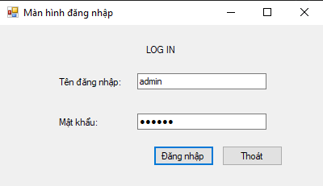

# Coffee Shop Management Application

## Introduction
Our Coffee Shop Management Application is designed to streamline the operations of a coffee shop. Built using Windows Forms on the .NET Framework 4.7.2, this application offers a comprehensive solution for managing tables, orders, food categories, and accounts. The system is backed by a robust SQL Server database, ensuring efficient data management and retrieval.

## Database Structure
The database `QuanLyQuanCafe` consists of several key tables:

### TableFood
```sql
CREATE TABLE TableFood
(
	[id] INT IDENTITY PRIMARY KEY,
	[name] NVARCHAR(100) NOT NULL DEFAULT N'Chưa có tên',
	[status] NVARCHAR(100) NOT NULL DEFAULT N'Trống'
)
```

### Account
```sql
CREATE TABLE Account
(
	[displayName] NVARCHAR(100) NOT NULL,
	[userName] NVARCHAR(100) PRIMARY KEY,
	[passWord] NVARCHAR(MAX) NOT NULL DEFAULT N'0',
	[type] INT NOT NULL
)
```

### FoodCategory
```sql
CREATE TABLE FoodCategory
(
	[id] INT IDENTITY PRIMARY KEY,
	[name] NVARCHAR(100) NOT NULL DEFAULT N'Chưa đặt tên'
)
```

### Food
```sql
CREATE TABLE Food
(
	[id] INT IDENTITY PRIMARY KEY,
	[name] NVARCHAR(100) NOT NULL DEFAULT N'Chưa đặt tên',
	[idCategory] INT,
	[price] FLOAT NOT NULL DEFAULT 0,

	FOREIGN KEY ([idCategory]) REFERENCES dbo.FoodCategory([id])
)
```

### Bill
```sql
CREATE TABLE Bill
(
	[id] INT IDENTITY PRIMARY KEY,
	[dateCheckIn] DATE NOT NULL DEFAULT GETDATE(),
	[dateCheckOut] DATE,
	[idTable] INT,
	[status] INT NOT NULL DEFAULT 0,
	[discount] INT NOT NULL DEFAULT 0,
	[totalPrice] FLOAT NOT NULL DEFAULT 0,

	FOREIGN KEY ([idTable]) REFERENCES dbo.TableFood([id])
)
```

### BillInfo
```sql
CREATE TABLE BillInfo
(
	[id] INT IDENTITY PRIMARY KEY,
	[idBill] INT NOT NULL,
	[idFood] INT,
	[count] INT NOT NULL DEFAULT 0,

	FOREIGN KEY ([idBill]) REFERENCES dbo.Bill([id]),
	FOREIGN KEY ([idFood]) REFERENCES dbo.Food([id])
)
```

## Application Screens

### 1. Login Screen
The login screen is the first point of interaction for users, allowing them to enter their credentials to access the system.
<center>



</center>

### 2. Management Screen
The management screen is used for selecting tables and placing orders. This screen provides a seamless interface for waitstaff to manage customer orders efficiently.
<center>


</center>

### 3. Personal Information Screen
This screen allows users to update their personal information, such as username and password. It ensures that users can manage their profiles securely.
<center>


</center>

### 4. Admin Screen
The admin screen includes several tabs for comprehensive management of the coffee shop's operations:

#### a. Statistics Tab
This tab allows admins to generate reports and view statistics based on bills within a selected time frame.
<center>


</center>

#### b. Categories Tab
Admins can view, add, delete, or modify food and drink categories using this tab.
<center>


</center>

#### c. Food Tab
This tab is used to manage food and drink items, including viewing, adding, deleting, and modifying item details.
<center>


</center>

#### d. Tables Tab
Admins can manage table information through this tab, which includes viewing, adding, deleting, and modifying tables.
<center>


</center>

#### e. Accounts Tab
This tab provides functionalities for managing user accounts, such as viewing, adding, deleting, and modifying account details.
<center>


</center>


## Conclusion
Our Coffee Shop Management Application is a powerful tool designed to simplify and enhance the operations of a coffee shop. With its user-friendly interface and robust database management, it ensures smooth and efficient handling of daily tasks. Whether it's managing tables, orders, or user accounts, this application provides a comprehensive solution for all your coffee shop management needs.